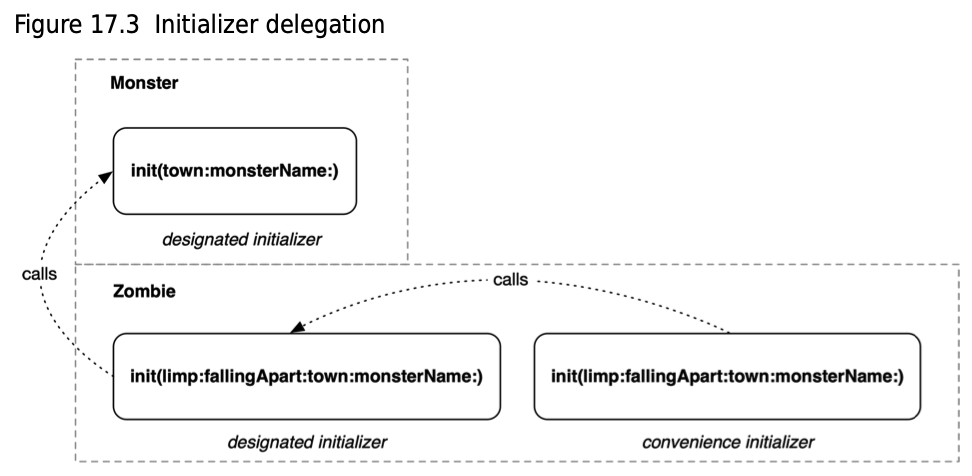
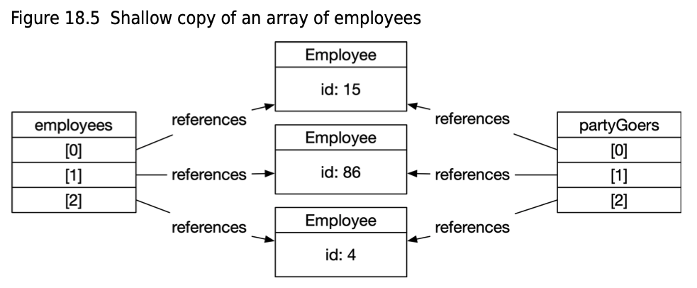

# Swift

## Notes

- A `framework` is a precompiled collection of types and functions you can use in your program

- camelCase(Swift preffered)/kebab-case/snake_case

== vs ===

- `===` is the identity operator, which checks whether two instances of a class point to `the same memory`. Two objects that were created independently using the same values will be considered equal using `==` but not `===` because they are different objects
- The `===` operator is available only when using **classes** because **structs** are designed so they are always uniquely referenced.

> Note: in js, the `==` operator will compare for equality after doing any necessary type conversions. The `===` operator will not do the conversion, so if two values are not the same type, `===` will simply return false.

---

```swift
var firstname = "Tom"   // variable
let lastname: String = "Smith"  // constent value, cannot be assigned to other value
// constant or variable will have to be assigned with an initial value

a...b   // closed range
a..<b   // b excluded
...b    // one sided range, upto b, b included
Int.randon(in: 1...10)

// where clause
for i in 1...100 where i % 3 == 0 {
  print(i)
}

let playground = "Hello, playground"
let start = playground.startIndex               // String.Index 0
let end = playground.index(start, offsetBy: 4)  // String.Index 4
let fifthCharacter = playground[end]            // "o"
let range = start...end
let firstFive = playground[range]               // "Hello"

// guard statement is used to exit early from a function if some condition is not met
guard let middleName = name.middle else {
    return
}
```

## Data Types:

- String
- Int (default 64 bits)
- Float (32 bits)
- Double (64 bits, default type for floating numbers)
- Bool
- Array [a, b][1]
- Dictionary [key: value]
- Struct

```swift
let a: Int16 = 200
let b: Int8 = 50
let c = a + b   // compile-time error. cannot add because they are different types
let c = a + Int16(b) // works
```

## Switch

```swift
var statusCode: Int = 13
var errorString: String = "The request failed with the error: "
switch statusCode {
case 401:
    errorString += "Unauthorized."
case 400...417:
    errorString += "Client error, \(statusCode)."
case 500...505:
    errorString += "Server error, \(statusCode)."
case let code where code < 100 || code >= 600:
    errorString = "\(code) is an illegal status code."
default:
    errorString = "Unexpected error encountered."
}

// if-case statement provides pattern matching similar to what a switch statement offers, but no default statement
let age = 25
if case 18...35 = age, age >= 25 {
   print("In cool demographic and can rent a car")
}
```

## Tuples

```swift
var statusCode: Int = 418
var errorString: String = "Unexpected error encountered."

let error = (statusCode, errorString) // (.0 418, .1 "Unexpected error encountered.")
// to access
error.0
error.1

// named tuple
let error = (code: statusCode, msg: errorString)
error.code
error.msg
```

## Dictionary

```swift
// declare a dictionary
var myDictionary = [String: String]()
let eggTimes = ["Soft": 5, "Medium": 7, "Hard": 12] // immutable
var dict: [String: Int] = ["Key" : 123]
dict["Key"]    // 123

// assign data into a distionary
myDictionary["SJD 293"] = "Red Ferrari"
myDictionary["UDS 111"] = "BMW"

// retrieve value as optional string
print(myDictionary["SJD 293"])
print(myDictionary["1"])        // nil

// remove
myDictionary["SJD 293"] = nil

// loop through
for (key, value) in myDictionary {
    print("\(key) is a \(value)")
}
for movie in movieRatings.keys {...}
```

## Array

```swift
// array declaration
var bucketList: Array<String>
// shorthand
var bucketList: [String] = ["a"]
// inference - bucketList will still only accept instances of the String type
var bucketList = ["a"]
// constructor syntax to create typed empty array
var bucketList = [String]()
var bucketList: [String] = []

bucketList[...2]            // first 3 items in the array
bucketList.remove(at: 1)

let array: [String] = ["Dog", "Car", "Bird"]
for counter in 0...array.count - 1 {
    print(array[counter])
}
for item in array {
    print(item)
}
myArray.insert("Frog", at: 0)
myArray += ["Frog", "Bear"]
// Frog Dog Car Bird Frog Bear
```

> `==` compares the content and order of 2 arrays

## Function

```swift
for counter in 1...5 { ... }
// parameter label
func addTwoNumbers(using number1: Int, and number2: Int ) -> Int {
    return number1 + number2
}
let sum = addTwoNumbers(using: 5, and: 5)

func addTwoNumbers(number1: Int, number2: Int ) -> Int {
    return number1 + number2
}
let sum = addTwoNumbers(number1: 5, number2: 5)

func addTwoNumbers(_ number1: Int, _ number2: Int ) -> Int {
    return number1 + number2
}
let sum = addTwoNumbers(5, 5)

// default parameter
func divisionDescriptionFor(numerator: Double,
                            denominator: Double,
                            withPunctuation punctuation: String = ".") {}
divisionDescriptionFor(numerator: 9.0, denominator: 3.0, withPunctuation: "!")

// multiple returns
// function types are made up of the function’s parameter and return types
// function type of sortedEvenOddNumbers(_:) is ([Int]) -> ([Int], [Int])
// a function with no arguments and no return has the type () -> ()
func sortedEvenOddNumbers(_ numbers: [Int]) -> (evens: [Int], odds: [Int]) {
    var evens = [Int]()
    var odds = [Int]()
    for number in numbers {
        if number % 2 == 0 {
            evens.append(number)
        } else {
            odds.append(number)
        }
    }
    return (evens, odds)
}

// you can assign a function type to a constant
let evenOddFunction: ([Int]) -> ([Int], [Int]) = sortedEvenOddNumbers
// use the constant to call the function
evenOddFunction([1,2,3])

let aBunchOfNumbers = [10, 1, 4, 3, 57, 43, 84, 27, 156, 111]
let theSortedNumbers = sortedEvenOddNumbers(aBunchOfNumbers)
print("The even numbers are: \(theSortedNumbers.evens); the odd numbers are: \(theSortedNumbers.odds)")
// The even numbers are: [10, 4, 84, 156]; the odd numbers are: [1, 3, 57, 43, 27, 111].

// input type is tuple; return type is optional String
func grabMiddleName(fromFullName name: (String, String?, String)) -> String? {
    return name.1
}
let middleName = grabMiddleName(fromFullName: ("Alice", nil, "Ward"))
if let name = middleName {
    print(name)
}
```

## Optional

```swift
// long form declaration
var errorCodeString: Optional<String> = Optional("404")
// shorthand
var errorCodeString: String? = "404"
var a: Int? = nil      // declare an optional, int or nil
var b: String? = nil   // declare an optional, string or nil

// c can store a string or nil, but it is wrapped
var c: String?         // default is nil - RECOMMENDED way to declare

// d can store a string or nil, but it is already unwrapped
var d: String!         // 更容易出错，d.method() 时不会再检查 d 是不是 nil

let eggTimes = ["Soft": 5, "Medium": 7, "Hard": 12]
let hardness = sender.currentTitle!    // convert optional to string
let result = eggTimes[hardness]!  // result is Int type

// 5 ways to check an optional to see if it contains an object
let myOptional: String? = nil
// 1. force unwrapping
let text: String = myOptional!  // will crash if the myOptional is nil

// 2. check first and then unwrap
if myOptional != nil {
    let text: String = myOptional!
} else {
    print("myOptional was found to be nil")
}

// 3. optional binding
// if myOptional is nil, go to else statement
// if myOptional is not nil, unwrap it and assign it to safeOptional
if let safeOptional = myOptional {
    let text: String = safeOptional  // safeOptional is already unwrapped
    print(safeOptional)
} else {
    print("myOptional was found to be nil")
}

var errorCodeString: String? = "404"
// the clause (errorCodeInt == 404) is only executed if both optionals are successfully unwrapped
if let theError = errorCodeString,
    let errorCodeInt = Int(theError),
    errorCodeInt == 404 {
        print("\(theError): \(errorCodeInt)")
}

// 4. nil coalescing operator
let text: String = myOptional ?? "default value"

// 5. optional chaining
class XmasPresent {
    func surprise() -> Int {
        return Int.random(in: 1...10)
    }
}
let present: XmasPresent? = XmasPresent()
// if present is nil, nothing happens, otherwise, run the statement
present?.surprise()
```

## Enum

```swift
enum TextAlignment {
    case left
    case right
    case center
}
var alignment: TextAlignment = TextAlignment.left
switch alignment {
case .left:
    print("left aligned")
case .right:
    print("right aligned")
case .center:
    print("center aligned")
}

// raw values
enum TextAlignment: Int {
    case left
    case right
    case center
    case justify
}
TextAlignment.left.rawValue  // 0
TextAlignment.right.rawValue // 1

enum TextAlignment: Int {
    case left       = 20
    case right      = 30
    case center     = 40
    case justify    = 50
}
// convert raw values to enum
let myRawValue = 20
if let myAlignment = TextAlignment(rawValue: myRawValue) {
    print("successfully created \(myAlignment) from \(myRawValue)")
    // successfully created left from 20
}

// enum with strings
enum ProgrammingLanguage: String {
    case swift      = "swift"
    case objectiveC = "objective-c"
    case c          = "c"
    case cpp        = "c++"
    case java       = "java"
}
let myFavoriteLanguage = ProgrammingLanguage.cpp
print("\(myFavoriteLanguage.rawValue)") // c++

enum LightBulb {
    case on
    case off

    func surfaceTemperature(forAmbientTemperature ambient: Double) -> Double {
        switch self {
        case .on:
            return ambient + 150.0
        case .off:
            return ambient
        }
    }
    // mark the method as mutating, which makes the implicit self argument mutable
    mutating func toggle() {
        switch self {
        case .on:
            self = .off
        case .off:
            self = .on }
    }
}

var bulb = LightBulb.on
let ambientTemperature = 77.0
var bulbTemperature = bulb.surfaceTemperature(forAmbientTemperature: ambientTemperature)
bulb.toggle()
bulbTemperature = bulb.surfaceTemperature(forAmbientTemperature: ambientTemperature)

enum ShapeDimensions {
    // point has no associated value - it is dimensionless
    case point
    // square's associated value is the length of one side
    case square(side: Double)
    // rectangle's associated value defines its width and height
    case rectangle(width: Double, height: Double)

    func area() -> Double {
        switch self {
        case .point:
            return 0
        case let .square(side: side):
            return side * side
        case let .rectangle(width: w, height: h):
            return w * h
        }
    }
}
var squareShape = ShapeDimensions.square(side: 10.0)
var rectShape = ShapeDimensions.rectangle(width: 5.0, height: 10.0)
print("square's area = \(squareShape.area())")
print("rectangle's area = \(rectShape.area())")
```

## Struct

- A `struct` is a type that groups a set of related chunks of data together **in memory**.

- Both `structures` and `enumerations` require the `mutating` keyword on methods that change the value of an instance’s properties.
  The `mutating` keyword asks the compiler to make the implicit `self` argument `inout`, so that the instance method can make changes to the original value the method was called on, instead of a copy

- `structures` and `enumerations` do not have `inheritance`

```swift
struct Town {
    let name: String
    var citizens: [String]
    var resources: [String: Int]

    // initializer - optional for struct, will have an empty and full initializer
    init(name: String, citizens: [String], resources: [String: Int]) {
        self.name = name
        self.citizens = citizens
        self.resources = resources
    }

    // method
    func fortify() {
        print("Defenses increased!");
    }

    // can only change a property using mutating within struct
    mutating func harvestRice() {
        resources["Rice"] = 100
    }
}
var town = Town(name: "Nameless Island", citizens: ["A", "B"], resources: ["Coconuts": 100])
town.citizens.append("C");
town.fortify()
town.harvestRice()
```

## Class

First, casting from a `subclass` to its `superclass` is called `upcasting` and is always safe.

Second, you can check an instance's type at runtime with the `is` keyword.

```swift
if fredTheZombie is Zombie {...}
```

```swift
class Employee {
    var name = "name"
    var salary = 0
    var role = ""

    func doWork() {
        print("My name is \(name) and I'm doing the work")
        salary += 1;
    }
}
let employee = Employee()

// inheritance
class Manager: Employee {
    var teamSize = 0

    override func doWork() {
        super.doWork()                // My name is Maggie and I'm doing the work
        print("I'm managing people")  // I'm managing people
        salary += 2
    }

    func firePeople() {
        print("I'm firing people")
    }
}

let e: Employee = Employee()
e.name = "Tom"
e.doWork()

var m = Manager()
m.name = "Maggie"
m.salary = 2000
m.role = "Manager of IT"
m.teamSize = 10
m.doWork()
m.firePeople()
```

```swift
class Person {
    var name = ""
    init() {
        name = "Joe"
    }

    init (_ name: String) {
        self.name = name
    }
}

let p = Person()
print(p.name)       // Joe

let p1 = Person("Tom")
print(p1.name)      // Tom


class Employee: Person {
  var salary = 0
  var role = ""

  override init() {
      super.init()
  }

  override init(_ name: String) {
      super.init(name)
      self.role = "Analyst"
  }

  func doWork() {
      print("My name is \(name) and I'm doing the work")
      salary += 1;
  }
}

let employee = Employee("Mark")     // Employee inherit init() from Person class as well
print(employee.name) // Mark
print(employee.role) // Analyst
```

## Class & Struct

A `struct` (or `enum`) variable stores the instance's entire value, we say that structs and enums are `value types`. You have also seen this behavior in the `Int`, `Float`, `Double`, `Bool`, etc. types. That is because they are also value types. In fact, they are implemented as structs in the Swift standard library.

`Class`, on the other hand, only use a variable to store a reference to some other location in memory where the instance's actual content is stored. i.e. `reference types`. That other location is managed by the system. You manage and pass around copies of your reference, and the system will manage the lifetime of the memory your variable refers to.

A `class` variable does not store all the bytes that make up the instance of the class, like a `struct` variable does. Since a `class` variable only stores a reference to where the real bytes are, setting `frederickTheZombie = fredTheZombie` merely means that `frederickTheZombie` contains a reference to the same bytes in memory that `fredTheZombie` does. Both variables refer to the same actual Zombie in memory, and you can use either reference to access the instance's name.

Just as `class` types contain only a reference to the instance, and not the entire instance itself, the same is true for function arguments of `class` types - including the implicit `self` argument of `class` instance methods. Since `self` is already a `reference` to the instance, and not a copy of it, the `self` implicit argument does not need to be made `inout`, so the `mutating` keyword is not used with `class` instance methods.

```swift
struct Town {
    static let world = "Earth"
    let region: String
    var population: Int {
        didSet(oldPopulation) {
            print("The population has changed to \(population) from \(oldPopulation).")
       }
    }
    var numberOfStoplights: Int

    init(region: String, population: Int, stoplights: Int) {
        self.region = region
        self.population = population
        numberOfStoplights = stoplights
    }

    // initializer delegation
    // initializer delegation ends up in an initializer that has all it needs to fully prepare an instance for use
    init(population: Int, stoplights: Int) {
        self.init(region: "N/A", population: population, stoplights: stoplights)
    }

    enum Size {
        case small
        case medium
        case large
    }

    var townSize: Size {
        switch population {
        case 0...10_000:
            return Size.small
        case 10_001...100_100:
            return Size.medium
        default:
            return Size.large
        }
    }

    func printDescription() {
        print("Population: \(population); number of stoplights: \(numberOfStoplights); region: \(region)")
    }

    // mutating - instance method to change a struct’s property
    mutating func changePopulation(by amount: Int) {
        population += amount
    }
}
```

- `classes` add the concepts of `designated` and `convenience` initializers. An initializer on a class is either one or the other.

- `Designated` initializers are responsible for making sure that an instance’s properties all have values before initialization completes, thus making the instance ready to use.

- `Convenience` initializers supplement `designated` initializers by calling across a class to its `designated` initializer. The role of `convenience` initializers is typically to create an instance of a `class` for a very specific use case.



```swift
class Monster {
    var town: Town?
    var name: String
    var victimPool: Int {
        get {
            return town?.population ?? 0
        }
        set(newVictimPool) {
            town?.population = newVictimPool
        }
    }

    init(town: Town?, monsterName: String) {
        self.town = town
        name = monsterName
    }

    func terrorizeTown() {
        if let terrorTown = town {
            print("\(name) is terrorizing the town \(terrorTown)!")
        } else {
            print("\(name) hasn't found a town to terrorize yet...")
        }
    }
}

class Zombie: Monster {
    var walksWithLimp: Bool
    private(set) var isFallingApart: Bool

    // designated initializer
    init(limp: Bool, fallingApart: Bool, town: Town?, monsterName: String) {
        walksWithLimp = limp
        isFallingApart = fallingApart
        super.init(town: town, monsterName: monsterName)
    }

    // After the convenience initializer calls the designated initializer, the instance is fully prepared for use.
    convenience init(limp: Bool, fallingApart: Bool) {
        self.init(limp: limp, fallingApart: fallingApart, town: nil, monsterName: "Fred")
        if walksWithLimp {
            print("This zombie has a bad knee.")
        }
    }

    deinit {
        print("Zombie \(name) is no longer with us.")
    }

    // Overriding a method means that a subclass provides its own definition of a method that is defined on its superclass
    override func terrorizeTown() {
        town?.changePopulation(by: -10)
        super.terrorizeTown()
    }
}

var myTown = Town(region: "Waet", population: 10_000, stoplights: 6)
var fredTheZombie: Zombie? = Zombie(limp: false, fallingApart: false, town: myTown, monsterName: "Fred")
fredTheZombie?.terrorizeTown()
fredTheZombie?.town?.printDescription()

var convenientZombie = Zombie(limp: true, fallingApart: false)
fredTheZombie = nil // deinit() calls

/**
 When you have a struct or enum variable, all the memory the instance needs to store its content is inside that variable.
 For example, a Town instance contains two Ints. Each Int is 64 bits (8 bytes) in size, so a variable that contains a Town takes up at least 16 bytes of memory.
 If you duplicate the variable, you duplicate the entire instance, copying its memory into the new variable.
 */
var yourTown = myTown // Now there are two towns!

myTown.changePopulation(by: 500)
myTown.printDescription()
// Population: 5922; number of stoplights: 4
yourTown.printDescription()
// Population: 5422; number of stoplights: 4

let fredTheZombie: Monster = Zombie()
fredTheZombie.town = myTown
fredTheZombie.terrorizeTown()
fredTheZombie.town?.printDescription()
// Population: 5912; number of stoplights: 4

/**
 when the program runs, fredTheZombie will contain an instance of Zombie, which has a walksWithLimp property. But the compiler complains that you said the variable might hold any Monster, so it cannot let you do Zombie-specific things to it.
*/
// fredTheZombie.walksWithLimp = true // compile error
(fredTheZombie as? Zombie)?.walksWithLimp = true
```

### Class

1. Mutable
2. Can inherit.
3. Passed by reference, object lives in HEAP
4. Work with objC code

```swift
let skeleton1 = Enemy(health: 100, attackStrength: 10)
let skeleton2 = skeleton1
skeleton1.takeDamage(amount: 10)
skeleton2.takeDamage(amount: 10)
print(skeleton1.health)         // 80
print(skeleton2.health)         // 80
```

### Struct

1. Immutable
2. Cannot inherit.
3. Passed by value, object lives in STACK
4. Deep copies/no memory leaks/thread safe

```swift
var skeleton1 = Enemy(health: 100, attackStrength: 10)  // HAS TO BE var
var skeleton2 = skeleton1   // // HAS TO BE var
skeleton1.takeDamage(amount: 10)
print(skeleton1.health)         // 90
print(skeleton2.health)         // 100
```

> Use `struct` as default, use `class` when inheritance or objc are needed.

## Designated & Convenience Initializer

```swift
class Person {
    var name: String
    var networth: Int?  // optional integer
    var gender: String!

    // DESIGNATED initializer ensures all of properties are initialized and the object is ready to be used
    init() {
        name = "None"
    }

    // CONVENIENCE initializer to preconfig the object in a certain way. may call designated initializer in it
    convenience init(_ gender: String, _ networth: Int) {
        // call the designated initializer to ensure the object is ready to use
        self.init()

        // set any other properties or custom code to initialize for this scenario
        self.gender = gender
        self.networth = networth
    }
}

class Polygon {
    var points: [CGPoint]

    init(points: [CGPoint]) {
        self.points = points
    }
    convenience init(squareWithLength length: CGFloat) {
        let points = [
            CGPoint(x: 0, y: 0),
            CGPoint(x: length, y: 0),
            CGPoint(x: length, y: length),
            CGPoint(x: 0, y: length),
        ]
        self.init(points: points)
    }
}
```

## Scope

```swift
func format(numbers: [Double],
            using formatter: (Double) -> String = {"\($0)"}) -> [String] {
    var result = [String]()
    for number in numbers {
        let transformed = formatter(number)
        result.append(transformed)
    }
    return result
}
func experimentWithScopes() {
    var numberOfTransformations = 0
    let rounder: (Double) -> String = {
        (num: Double) -> String in
        numberOfTransformations += 1
        return "\(Int(num.rounded()))"
    }
    let volunteerAverages = [10.75, 4.2, 1.5, 12.12, 16.815]
    let roundedAveragesAsStrings = format(numbers: volunteerAverages, using: rounder)
    let exactAveragesAsStrings = format(numbers: volunteerAverages) // ["10.75", "4.2", "1.5", "12.12", "16.815"]
}
print(numberOfTransformations) // 5
```

## as, as?, as!

```swift
class Animal {
    var name: String
    init(name: String) {
        self.name = name
    }
}
class Human: Animal {
    func code() {...}
}

class Fish: Animal {
    func breathUnderWater() {...}
}

let human1 = Human(name: "human 1")
let human2 = Human(name: "human 2")
let fish1 = Fish(name: "fish 1")

let neighbours = [human1, human2, fish1] // neighbours type is [Animal]
let neighbour1 = neighbours[0] // neighbour1 type is Animal
if neighbours[0] is Human {...} // result to true

func findNemo(from animals: [Animal]) {
    for animal in animals {
        if animal is Fish {
            print(animal.name)  // type of animal is still Animal
            let fish = animal as! Fish  // downcast - fish is type Fish
            fish.breathUnderWater()
            let animalFish = fish as Animal // animalFish is type Animal
        }
    }
}

let fish = neighbours[1] as! Fish // run time error: could not cast value of type
let fish = neighbours[1] as? Fish // fish is type Fish? - optional
if let fish = neighbours[1] as? Fish {
    fish.breathUnderWater()
}
if let messageCell = cell as? MessageCell {
    ...
} else {...}
let newCell = messageCell as UITableViewCell // up casting - convert to the superclass
```

## Any, AnyObject, NSObject

- Any: all objects
- AnyObject: objects derived from classes, NOT struct
- NSObject: foundation objects only - apple created objects

```swift
let neighbours = [human1, human2, fish1] // [Animal]
let num = 12
let neighbours: [Any] = [human1, human2, fish1, num] // [Any]
// cannot convert Int to AnyObject, because Int is struct, NOT a class
let neighbours: [AnyObject] = [human1, human2, fish1, num] // compile error

let num: NSNumber = 12
let word: NSString = "abc"
let array: [NSObject] = [num, word]  // NSObject will work with NSNumber and NSString
```

## Properties

### Stored Properties

#### Nested & Lazy stored properties

Sometimes a stored property’s value cannot be assigned immediately. The necessary information may be available, but computing the values of a property immediately would be costly in terms of memory or time. Or, perhaps a property depends on factors external to the type that will be unknown until after the instance is created. These circumstances call for `lazy loading`.

Marking `townSize` as `lazy` indicates to the compiler that this property does not need to have a value for self to be considered fully initialized and that its initial value should instead be assigned the first time it is read.

It is important to note that properties marked with `lazy` are calculated **only one time**. This feature of `lazy` means that changing the value of myTown’s `population` does NOT cause myTown’s `townSize` to be recalculated.

If you only needed to calculate the town's size **once**, a `lazy stored property` would be perfect

```swift
struct Town {
    var population = 5_422
    var numberOfStoplights = 4

    enum Size {
        case small
        case medium
        case large
    }

    // set the value of townSize to the result returned by a closure
    // The lazy keyword ensures that this happens the first time the property is read,
    // and only if a value has not already been assigned, rather than when the Town instance is created.
    lazy var townSize: Size = {
        switch population {
        case 0...10_000:
            return Size.small
        case 10_001...100_100:
            return Size.medium
        default:
            return Size.large
        }
    }() // Swift will execute the closure and assign the value it returns to townSize
    ...
}
var myTown = Town()
let myTownSize = myTown.townSize // small
```

### Computed Property

A `computed property` provides a `getter` and `optional setter` to retrieve or set the property’s value

```swift
var townSize: Size {
    switch population {
    case 0...10_000:
        return Size.small
    case 10_001...100_000:
        return Size.medium
    default:
        return Size.large
    }
}

class Monster {
    var town: Town?
    var name = "Monster"
    var victimPool: Int {
        get {
            return town?.population ?? 0
        }
        set(newVictimPool) {
            town?.population = newVictimPool
        }
    }
    ...
}
fredTheZombie.victimPool
fredTheZombie.victimPool = 500
```

```swift
// calculated properties
var bonus: Int {
  return teamSize * 1000
}

struct WeatherModel {
    let conditionId: Int
    let cityName: String
    let temperature: Double

    // computed property, have to be var
    var temperatureString: String {
        return String(format: "%.1f", temperature)
    }

    // computed property, have to be var
    var conditionName: String {
        switch conditionId {
        case 200...232:
            return "cloud.bolt"
        case 300...321:
            return "cloud.drizzle"
        case 500...531:
            return "cloud.rain"
        case 600...622:
            return "cloud.snow"
        case 701...781:
            return "cloud.fog"
        case 800:
            return "sun.max"
        case 801...804:
            return "cloud.bolt"
        default:
            return "cloud"
        }
    }
}
```

```swift
let pizzaInInches: Int = 16
var numberOfPeople: Int = 12
let slicesPerPerson: Int = 4

// getter
// note - var, data type, and return required
var numberOfSlices: Int {
    get {
        return pizzaInInches - 4
    }
}

// getter & setter
var numberOfPizza: Int {
    get {
        let numberOfPeopleFedPerPizza =  numberOfSlides / slicesPerPerson
        return numberOfPeople / numberOfPeopleFedPerPizza
    }
    set {
        let totalSlices = numberOfSlices * newValue
        numberOfProple = totalSlices / slidesPerPerson // numberOfPeople will need to be var
    }
}
numberOfPizza = 4
print(numberOfPeople) // 12
```

### Observed Property

`Property observation` is available to any `stored property` but not `computed properties`.

```swift
var pizzaInInches: Int = 10 {
    willSet {
        print(pizzaInInches) // 10
        print(newValue) // 8
    }
    didSet {
        print(oldValue) // 10
        print(pizzaInInches) // 8
    }
}
pizzaInInches = 8
```

### Type Properties

All instances of a `Square` type will have exactly four sides, so the number of sides for Square might be stored in a `type property`. If you create 1,000 instances of `Square` in your program, a type property for a square's number of sides will only exist **once** in memory, rather than 1,000 times.

`Type properties` of `value types` begin with the `static` keyword

```swift
struct Town {
    static let world = "Earth"
    ...
}
```

`Classes` can also have stored and computed `type properties`, which use the same static syntax as `structs`. Subclasses cannot override a type property from their superclass. If you want a subclass to be able to provide its own implementation of the property, you use the `class` keyword instead.

```swift
class Monster {
    static let isTerrifying = true
    class var spookyNoise: String {
        return "Grrr"
    }
}
class Zombie: Monster {
    override class var spookyNoise: String {
        return "Brains..."
    }
}
```

## Access Level

`private` - {} block scope

`fileprivate` - file scope

`internal`(default) - inside the current app `module`, e.g. clima project

`public` - other modules

`open` - other modules + allow class or functions to be subclassed or overridden

## Value types vs Reference types

- `value types` are **copied** when they are assigned to an `instance` or passed as an argument to a `function`.
- Array, Dictionary, Int, String are all value types - implemented as structs
- But for an instance of a `reference type`, these two actions create an additional reference to the same underlying instance
- `Reference type` variable is always 64 bits (8 bytes)
- Contrast that with a struct instance being passed around with 500 integers inside it. Every time that struct instance is passed, 4 more kilobytes are allocated to hold the new copy of the struct.

```swift
class Employee {
    var id: Int = 0
    var name: String
    init(name: String) {
        self.name = name
    }
}

struct Company {
    var boss: Employee
}

let anika = Employee(name: "anika")
let mel = Employee(name: "mel")
let juampa = Employee(name: "juampa")
let employees = [anika, mel, juampa]    // [{id 15}, {id 86}, {id 0}]
// shallow copy
let partyGoers = employees              // [{id 15}, {id 86}, {id 0}]
employees.last?.id = 4
employees                               // [{id 15}, {id 86}, {id 4}]
partyGoers                              // [{id 15}, {id 86}, {id 4}]
```



### Equality

Equality refers to two instances having the same values for their observable characteristics, such as two instances of the String type that have the same text.

All Swift’s basic data types (String, Int, Float, Double, Array, Set, and Dictionary) can be checked for equality.

### Identity

Identity refers to whether two `references` point to the same instance `in memory`.

Check for identity on two new instances using the identity operator (===) to see whether they point to the same instance.

### var vs let

Value type

```swift
struct Hack {
    var platform: String
    let claps: Int
}

let constantBlog = Hack(platform: "ios", claps: 140)
constantBlog.platform = "android"   // Cannot assign to property: ‘constantBlog’ is a ‘let’ constant.
constantBlog.claps = 150            // Cannot assign to property: ‘claps’ is a ‘let’ constant.

var variableBlog = Hack(platform: "ios", claps: 140)
variableBlog.platform = "android"
variableBlog.claps = 150            // Cannot assign to property: ‘claps’ is a ‘let’ constant.
```

Reference type

```swift
class Hack {
    var platform: String
    let claps: Int

    init(platform: String, claps: Int) {
        self.platform = platform
        self.claps = claps
    }
}

let constantblog = Hack(platform: "ios", claps: 140)
constantblog.platform = "android"
constantblog.claps = 150            // Cannot assign to property: ‘claps’ is a ‘let’ constant

var variableBlog = Hack(platform: "ios", claps: 140)
variableBlog.platform = "android"
variableBlog.claps = 150            // Cannot assign to property: ‘claps’ is a ‘let’ constant
```
