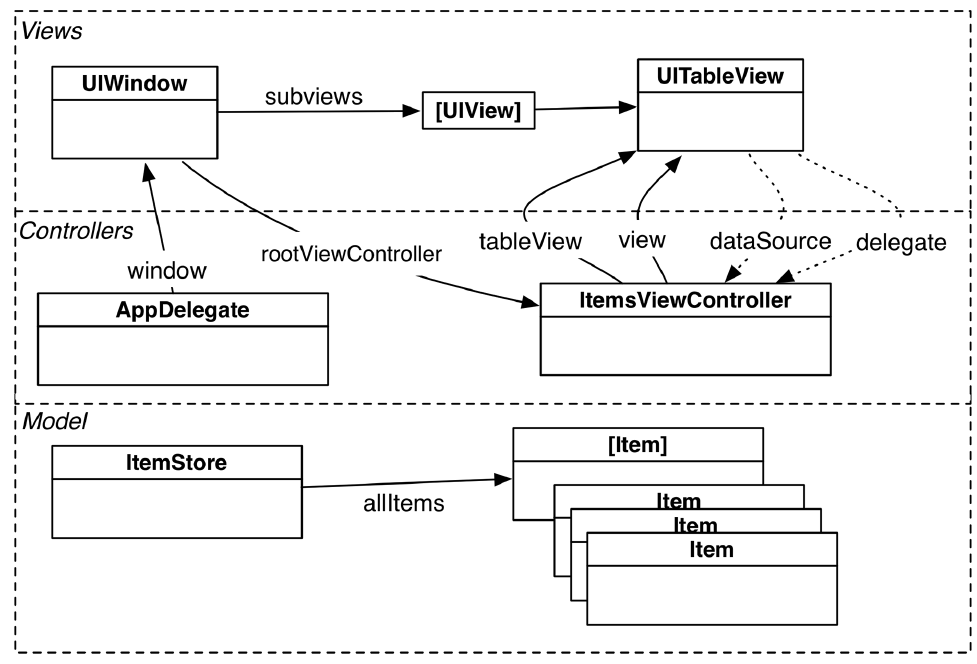
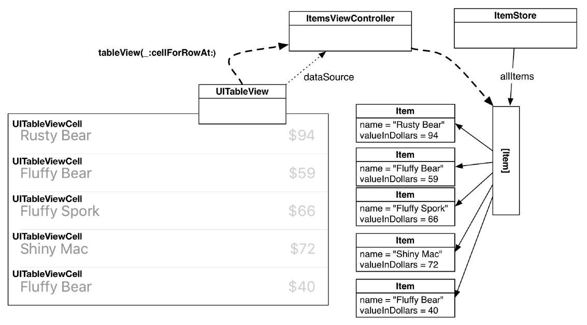
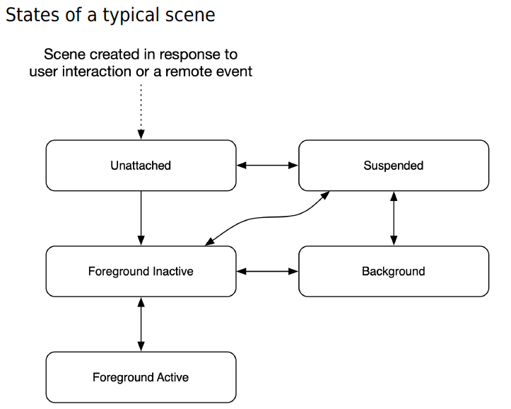
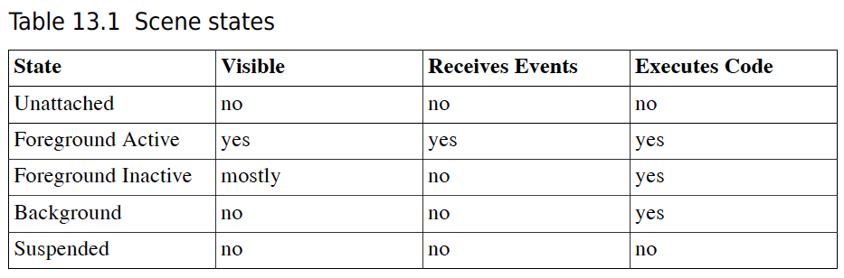

## Delegate Design Pattern - with Protocol

```swift
// define the required functions in protocol, but no implementation
protocol AdvancedLifeSupport {
    func performCPR()
}

// similar to TextField class
// EmergencyCallHandler don't care who can do performCPR, as long as they adopt the AdvancedLifeSupport protocol
class EmergencyCallHandler {
    var delegate: AdvancedLifeSupport?

    func assessSituation() { ... }

    func medicalEmergency() {
        delegate?.performCPR()
    }
}

// Paramedic adopts the AdvancedLifeSupport protocol
struct Paramedic: AdvancedLifeSupport {
    // when the paramedic is going on call
    init(handler: EmergencyCallHandler) {
        // set the handler's delegate to the paramedic self
        handler.delegate = self
    }

    func performCPR() { // implementation... }
}

class Doctor: AdvancedLifeSupport {
    init(handler: EmergencyCallHandler) {
        handler.delegate = self
    }

    func performCPR() { // implementation... }
    func useStethescope() { ... }
}

class Surgeon: Doctor {
    override func performCPR() {
        super.performCPR()
        // do more stuff on behalf of Surgeon...
    }

    func useElectricDrill() { ... }
}

let emilio = EmergencyCallHandler()
let pete = Paramedic(handler: emilio)
let angela = Surgeon(handler: emilio)

emilio.assessSituation()
emilio.medicalEmergency()
```

## ViewController LifeCycle

- viewDidLoad() - IBOutlet/IBAction is created and connected, called only ONCE
- viewWillAppear() - configure the view controller’s view **each time** it appears on screen
- viewDidAppear() - user is able to see the view
- viewWillDisappear() - when navigate back or dismiss the view
- viewDidDisappear() - does not mean the view is destroyed

Override **viewDidLoad()** if the configuration only needs to be done once during the run of the app. Override **viewWillAppear(\_:)** if you need the configuration to be done each time the view controller’s view appears onscreen.

**viewWillAppear(\_:)** and **viewDidAppear(\_:)** are called `every time` your view controller is moved onscreen. **viewWillDisappear(\_:)** and **viewDidDisappear(\_:)** are called `every time` your view controller is moved offscreen.

## App LifeCycle

```swift
// open the app
application(_:didFinishLaunchingWithOptions:)
scene(_:willConnectTo:options:)
viewDidLoad()
viewWillAppear()
sceneWillEnterForeground()
sceneDidBecomeActive()
viewDidAppear()
// bring the app to the multitasking screen
sceneWillResignActive()
// navigate to another app
sceneDidEnterBackground()
// relaunch the app
sceneWillEnterForeground()
sceneDidBecomeActive()
// kill the app
sceneWillResignActive()
sceneDidDisconnect()
application(_:didDiscardSceneSessions:)
```

## Singleton

```swift
class Car {
    var color = "Red"
    static let singletonCar = Car()
}

let myCar = Car.singletonCar
meCar.color = "Blue"
let yourCar = Car.singletonCar
print(yourCar.color)  // Blue
```

## Swift

In fact, all these Swift types are structures:

- Numbers: Int, Float, Double
- Boolean: Bool
- Text: String, Character
- Collections: Array<Element>, Dictionary<Key:Hashable,Value>, Set<Element:Hashable>

## View Auto Layout

## View Controller

## Text Input and Delegation

## Internationalization and Localization

Internationalized – its interface is able to adapt to various languages and regions.
Localized – update the strings and resources in the application for a new language.

## UITableView and UITableViewController



Interface Builder and the iOS SDK refer to instances of an application’s UI as `scenes`. A `scene` is an instance of `UIScene` and is responsible for managing one instance of an application’s UI.

For `ItemsViewController` to conform to `UITableViewDataSource`, it must implement **tableView(\_:numberOfRowsInSection:)** and **tableView(\_:cellForRowAt:)**. These methods tell the table view how many rows it should display and what content to display in each row.

UITableViewCell


## Subclassing UITableViewCell

## Stack Views

## Saving && Loading

Codable

Property Lists

Sandbox

Scene States



When a scene is not running, it is in the unattached state, and it does not execute any code or have any memory reserved in RAM.

After a scene is launched, it briefly enters the foreground inactive state before entering the foreground active state. When in the foreground active state, a scene’s interface is on the screen, it is accepting events, and its code is handling those events.

While in the active state, a scene can be temporarily interrupted by a system event, like a phone call, or interrupted by a user event, like triggering Siri or opening the task switcher. At this point, the scene reenters the foreground inactive state. In the inactive state, a scene is usually visible and is executing code, but it is not receiving events. Scenes typically spend very little time in the inactive state.

When the user returns to the Home screen or switches to another application, the scene enters the background state. (Actually, it spends a brief moment in the foreground inactive state before transitioning to the background state.) In the background state, a scene’s interface is not visible or receiving events, but it can still execute code.

By default, a scene that enters the background state has about 10 seconds before it enters the suspended state. But your scenes should not rely on having this much time; instead, they should save user data and release any shared resources as quickly as possible.

A scene in the suspended state cannot execute code. You cannot see its interface, and any resources it does not need while suspended are destroyed. A suspended scene is essentially flash-frozen and can be quickly thawed when the user relaunches it.

A scene in the suspended state will remain in that state as long as there is adequate system memory. When the OS decides memory is getting low, it will terminate suspended scenes as needed, moving them to the unattached state.



Notification Center

```swift
let notificationCenter = NotificationCenter.default
notificationCenter.addObserver(self,
                               selector: #selector(retrieveDog(_:)),
                               name: Notification.Name(rawValue: "LostDog"),
                               object: nil)

@objc func retrieveDog(_ notification: Notification) {
    let poster = notification.object
    let name = notification.name
    let extraInformation = notification.userInfo
}

let extraInfo = ["Name": "Fido"]
let notification = Notification(name: Notification.Name(rawValue: "LostDog"),
                                object: self,
                                userInfo: extraInfo)
NotificationCenter.default.post(notification)
```

Here are some of the notifications that announce scene state transitions:

- UIScene.willConnectNotification
- UIScene.didDisconnectNotification
- UIScene.willEnterForegroundNotification
- UIScene.didActivateNotification
- UIScene.willDeactivateNotification
- UIScene.didEnterBackgroundNotification

## Present AlertController

## Camera, Cache, and Image Persistance

## Adaptive Interfaces

- Size Classes
- Dark Mode

## Extensions and Container View Controller

## Custom Controls

## Animations

## Web Service

URLSessionTask

- URLSessionDataTask
- URLSessionDownloadTask
- URLSessionUploadTask

```swift
// Result<[Photo], Error> defines a `Result` where the success case is associated with an array of photos
// and the failure case is associated with any Error.
static func photos(fromJSON data: Data) -> Result<[Photo], Error> {
    do {
        let decoder = JSONDecoder()
        let flickrResponse = try decoder.decode(FlickrResponse.self, from: data)
        return .success(flickrResponse.photosInfo.photos)
    } catch {
        return .failure(error)
    }
}
```

Notice that this new method returns a `Result` type. `Result` is an `enumeration` defined within the Swift standard library that is useful for encapsulating the result of an operation that might succeed or fail.

Result has two cases, `success` and `failure`, and each of these cases has an associated value that
represents the successful value and error, respectively.

For `Result`, there are two placeholders that you define: what kind of value it should contain on success and what kind of value it should contain on failure. Notice the `where` clause at the end, this limits the `failure` associated value to be some kind of Error.

```swift
public enum Result<Success, Failure> where Failure : Error {
    /// A success, storing a `Success` value.
    case success(Success)
    /// A failure, storing a `Failure` value.
    case failure(Failure)
}
```

## Collection View

Collection View Data Source

## Core Data

## Core Data Relationships
